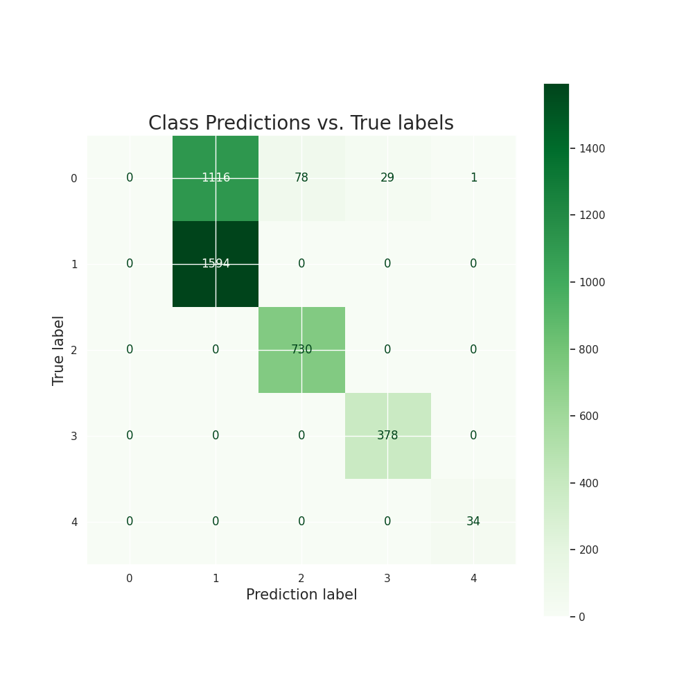

# Child Mind Institute - Problematic Internet Usage (Kaggle Competition)

## Business Problem

The goal of this project is to use physical activity and fitness data to determine the likelihood that children and adolescents will exhibit problematic internet usage.
In this instance, problematic internet usage can be defined as, "the use of the Internet that creates psychological, social, school and/or work difficulties in a person's life" (Beard and Wolf, 2001).
<!-- (https://www.sciencedirect.com/science/article/abs/pii/S0165178119320098#:~:text=Problematic%20Internet%20use%20(PIU)%20is,Beard%20and%20Wolf%2C%202001).) -->

The desired outcome of achieving the goals of this project is that the findings could then be used to improve treatments, interventions, and general awareness when it comes to mental and physical health and wellbeing.

The data provided for this project reflects the realities of many real-world datasets: it is very sparse with lots of values missing for certain rows.
The target variable, 'sii' (Severity Impairment Index) is missing for a large portion of the training data.
My strategy to deal with this is to utilized semi-supervised learning modeling techniques, where the model learns from the non-null target values to then predict the missing values and be used to generate a final prediction on the unseen data.

## Data Exploration

The data in this project includes two CSV files (train.csv and test.csv) that contain demographic, survey, and physical metrics on the study participants, as well as two parquet files containing actigraphy data for some of the participants. The actigraphy data reflects data collected from an accelerometer that some participants wore for up to 30 days.
Within the train CSV file, there are 3960 rows and a total of 82 features/columns (including the target, 'sii'), many of which contain null values. The test CSV file contains 20 rows and a total of 59 columns.

The train parquet file contains 996 rows and 97 columns. The test parquet file contains 2 rows and 97 columns.
Of the total participant IDs in the train csv file, only 996 are included in the train parquet file. We do not have actigraphy data for the remaining participants.

Additionally, a data dictionary file is provided, which gives each data feature, the data type, and where the data was collected from.

## Pre-Processing

One of the data features to be preprocessed is the feature(s) containing BMI information for the participants, as there are actually two different features for this from different sources. There is a BMI feature from the Physical examination as well as a BMI feature from the Bio-Electric Impedance Analysis. Many participants have only one of these values filled in and many have neither filled in.
To simplify this, I combine these features into a single feature. If only one value is not null, that will be the value for this feature, if neither are null, an average is taken, and if both are null, the feature will remain null. Then, the original two BMI columns are dropped.

The data from the parquet file is merged with the train CSV data. Since the ID column does not contain any relevant information for modeling, this feature is dropped for now.

In the train data, there are a series of values from the Parent-Child Internet Addiction Test (PCIAT). These values were used to obtain the 'sii' target values and are therefore not included in the test data. For this reason, these features cannot be used to train a model because they are not present in the test data and the model will not be able to generate predictions. Therefore, I drop them all.

Next, there are multiple features that indicate the seasons in which a particular test took place. These categorical values must all be encoded into numerical values for modeling. I do this using Scikit-Learn's Label Encoder.

Finally, the target value is temporarily removed from the training data while the other null values are dealt with. Using Scikit-Learn's KNN Imputer, I then fill the null data values using up to 8 neighbors. 

## Modeling

The target column is added back into the data and all null target values are filled with a value of -1.

The data is scaled and split into training and testing data for modeling purposes.

Scikit-Learn's SelfTrainingClassifier makes it possible to use supervised learning models in a semi-supervised way. I try this with a variety of different base models, including RandomForestClassifier, AdaBoostClassifier, and XGBClassifier.
Of these, the best performing model used XGBoostingClassifier as the base estimator.
 
Hyperparameter tuning was attempted using GridSearchCV, however it did not appear to improve model performance. Therefore, the best performing model remains the SelfTrainingClassifier model that used XGBoostingClassifier as the base estimator. 
This model is used to generate predictions for the test data (test.csv).

## Results

The best performing model, when tested using an unseen portion of the train dataset, received a Quadratic Weighted Kappa score of 0.7252. 
This is an improvement from the baseline model, which received a QWK score of about 0.2019. 
This is still not a very good value, as we want the QWK to be as close to 1.0 as possible.

<!--  -->

## Conclusion

#### Limitations:
- The data provided for this task is very sparse, containing a large amount of null values for most features, including the target (sii). This means that in order to accomplish this project task, either an unsupervised learning model needs to be used, which can often be difficult to evaluate, or these values need to be dealt with prior to modeling. I chose a semi-supervised modeling approach that would use existing target values to first predict and fill the missing values before being used to generate test set predictions. However effective this method may be, we don't know for sure if these predicted target values are correct, or if the imputed missing values for the other features are accurate. When this filled-in data is used for modeling, the model may detect patterns that are not really there or not as strong as they are in reality. This can have unseen impacts on the results of modeling.
- Similarly to the previous point, some of the features present in the training dataset (train_ds), are not present in the test dataset (test_ds). This means that if the model relies on these features during training to make predictions, then the model will not be able to make predictions as well for the test dataset. 
- Another limitation of the data is the very large number of features. This increases the complexity of the data, which can affect the modeling process. More complex data can lead to model overfitting and thus the model will not perform as well on unseen data. I used multiple techniques to reduce the impact of this, however there may be other techniques that would work even better and reduce this complexity even further.

#### Next Steps:
Although the final model performed very well, it is possible that this result could be improved even further by trying out different techniques in pre-processing and modeling. In future research, this result may be improve by:
- including data from a greater number of test subjects
- including more complete data for test subjects
- experimenting with other ways of imputing/filling missing values including target values (sii)
- experimenting with other types of models for multiclass classification

